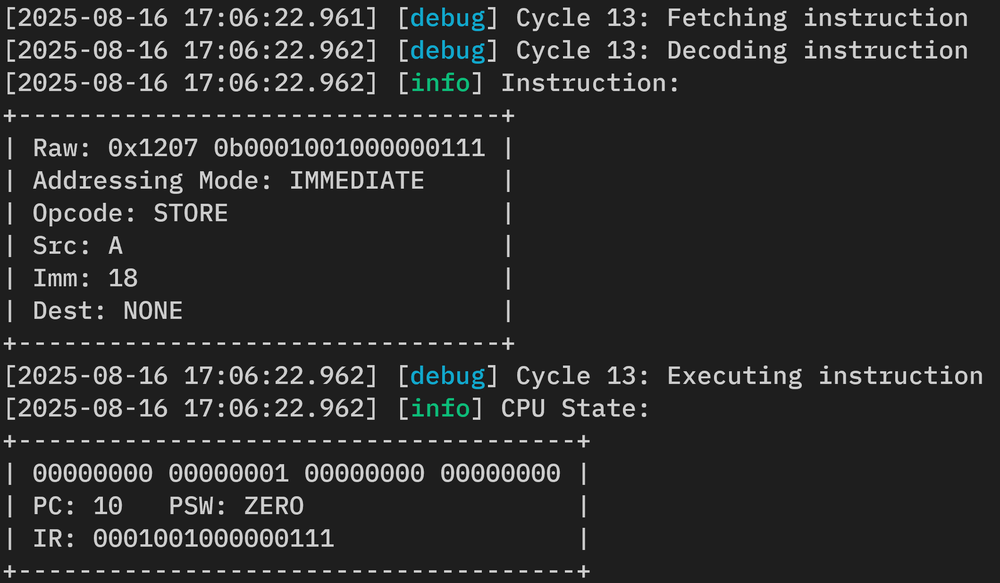

# CPU Microarchitecture Emulator

<p align="center"></p>

Emulator for the original design DLW-1 CPU microarchitecture.

Built with C++23 and Clang, using a CMake cross-platform build system, clang-format for code formatting, and clang-tidy for static analysis and linting. Utilizes GTest for unit testing, cxxopts for the CLI, and spdlog for logging.

## About

This project implements a complete emulator for the DLW-1 CPU microarchitecture. The emulator supports configurable memory banks, multiple addressing modes (register, immediate, relative), and provides detailed instruction-level execution logging. It includes a sample countdown program that demonstrates the CPU's instruction set architecture.

For complete hardware, ISA, and assembly specifications, see [DLW-1.pdf](./DLW-1.pdf).

## Setup

### Prerequisites
**Windows:**
- Visual Studio 2022 with Clang 17+
- CMake 3.21 or higher
- Git

**Unix-like (Linux/macOS):**
- Clang 17+
- CMake 3.21 or higher
- Git
- Build essentials (make, ninja, etc.)

### Building from Source

1. **Clone the repository:**

    ```bash
    git clone https://github.com/siddhp1/DLW-1
    cd DLW-1
    ```

2. **Configure and build using CMake presets:**

    **Windows:**
    ```bash
    cmake --preset windows-clang-release
    cmake --build --preset windows-clang-release
    ```

    **Unix-like (Linux/macOS):**
    ```bash
    cmake --preset unixlike-clang-release
    cmake --build --preset unixlike-clang-release
    ``` 

## Usage

Run the DLW-1 Emulator with the following command:

```bash
emulator [OPTIONS]
```

Options:
```text
  -f, --file [PATH]                         Set program file path
  -b, --banks [NUMBER OF BANKS]             Configure number of memory banks (default: 1, range: 1-255)
  -c, --console-level [LOG LEVEL]           Configure console log level [debug, info, warn, error, off] (default: info)
  -l, --file-level [LOG LEVEL]              Configure file log level [debug, info, warn, error, off] (default: debug)
  --version                                 Print version information
  --help                                    Print usage information
```

Examples:

The following command runs the sample program with DEBUG logging to the console:

```bash
emulator -f sample_program.bin -c debug
```

For an explanation of the sample program, see [SAMPLE-PROGRAM.md](./SAMPLE-PROGRAM.md).

## License

This project is licensed under the MIT License.
